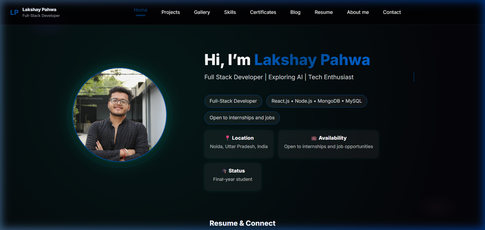
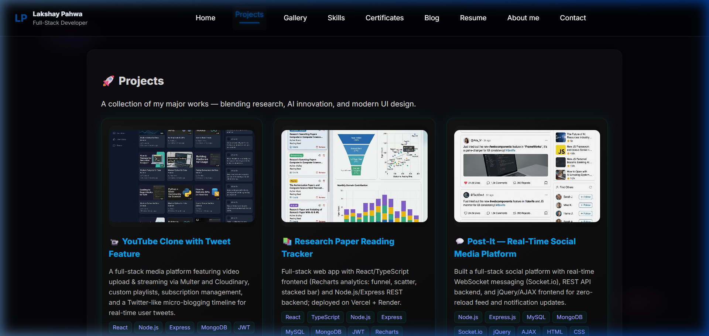
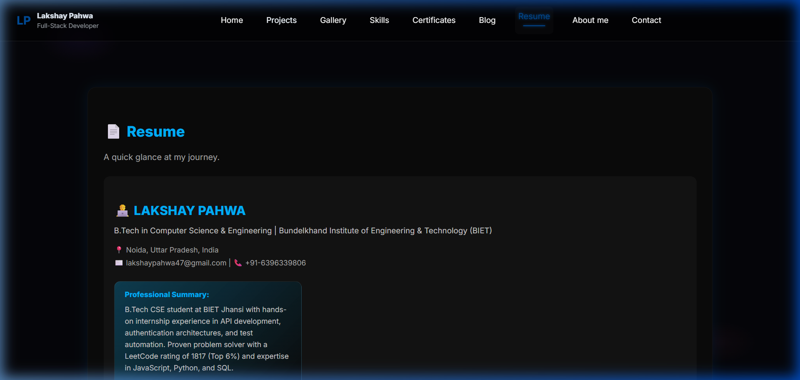

# 💻 Lakshay Pahwa — Personal Portfolio Website

Welcome to my personal portfolio website, built with **React.js**, **Framer Motion**, and modern, premium design aesthetics. This site showcases my work, projects, skills, and journey as a developer passionate about **Full-Stack Development, APIs, and AI integrations**.

🌐 **Live Website:** [https://github.com/pahwajii/Myweb](https://github.com/pahwajii/Myweb)

---

## 🖼️ Screenshots

### Home Page


### Projects Page


### Resume Page


---

## 🚀 Projects Showcased

1. **📹 YouTube Clone with Tweet Feature (`chai-backendd`)**
   * A full-stack media platform featuring video upload & streaming via Multer and Cloudinary, custom playlists, subscription management, and a Twitter-like micro-blogging timeline.
   * **Tech:** React, Node.js, Express, MongoDB, JWT, Cloudinary, Multer, Tailwind CSS

2. **📚 Research Paper Reading Tracker (`research_paper`)**
   * Full-stack web app with a React/TypeScript frontend (Recharts analytics: funnel, scatter, stacked bar) and a Node.js/Express REST backend for managing and tracking reading stages of papers.
   * **Tech:** React, TypeScript, Node.js, Express, MySQL, MongoDB, JWT, Recharts

3. **💬 Post-It — Real-Time Social Media Platform (`social_web`)**
   * A full-stack social platform with real-time WebSocket messaging (Socket.io), REST API backend, and a jQuery/AJAX frontend for a zero-reload feed and notification experience.
   * **Tech:** Node.js, Express.js, MySQL, MongoDB, Socket.io, jQuery, AJAX, HTML, CSS

4. **📊 Gemini Analyst Research Tool (`Research_tool`)**
   * A web-based document intelligence portal that digests financial earnings transcripts (PDF, DOCX, TXT) using the Gemini LLM to generate structured, analyst-ready summaries.
   * **Tech:** React, Node.js, Express, Gemini API, Cloudinary, Multer, Tailwind CSS

5. **🟢 Plinko Lab — Provably Fair Game (`plinko-lab`)**
   * A deterministic 12-row Plinko game implementation in Next.js and Prisma featuring an interactive visual board, user-controlled client seed/bet parameters, and a commit-reveal fairness scheme.
   * **Tech:** Next.js, React, TypeScript, Tailwind CSS, Prisma, SQLite, Jest

6. **💳 Subscription-based Payment System (`razorpay_integration`)**
   * Webhook-based payment reconciliation covering full subscription lifecycle; reduces failed-transaction fallthrough by 40% via Regex-based event classification and retry logic.
   * **Tech:** Node.js, MySQL, Razorpay API, Webhooks, Jest, OOP

---

## ⚙️ Setup & Installation Instructions

To run this project locally:

```bash
# 1️⃣ Clone the repository
git clone https://github.com/pahwajii/Myweb.git

# 2️⃣ Navigate to project directory
cd Myweb

# 3️⃣ Install dependencies
npm install

# 4️⃣ Run development server
npm run dev
```

The application will run on [http://localhost:5173](http://localhost:5173) 🚀

---

## 📬 Contact & Connect

If you'd like to collaborate, discuss internship opportunities, or just say hi, feel free to reach out!

* 📧 **Email:** [lakshaypahwa47@gmail.com](mailto:lakshaypahwa47@gmail.com)
* 💼 **LinkedIn:** [linkedin.com/in/lakshay-pahwa-a45991251](https://www.linkedin.com/in/lakshay-pahwa-a45991251)
* 🐙 **GitHub:** [github.com/pahwajii](https://github.com/pahwajii)
* 🏆 **LeetCode:** [leetcode.com/u/pahwajii/](https://leetcode.com/u/pahwajii/)

---

### 🏁 License

This project is open-source and available under the [MIT License](LICENSE). Feel free to fork, use, and build upon it!
